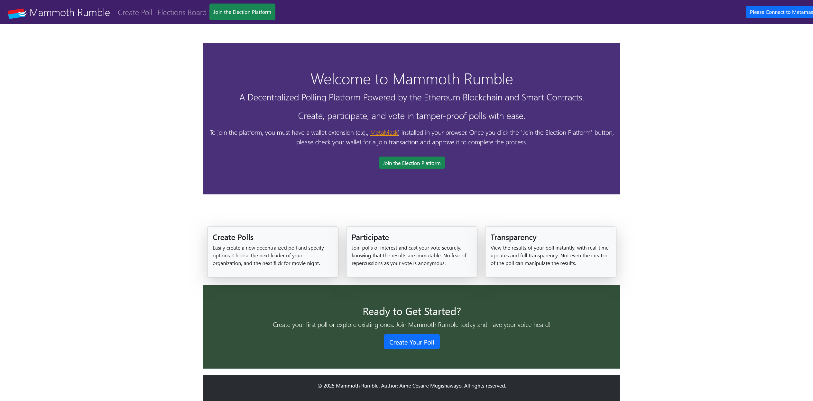
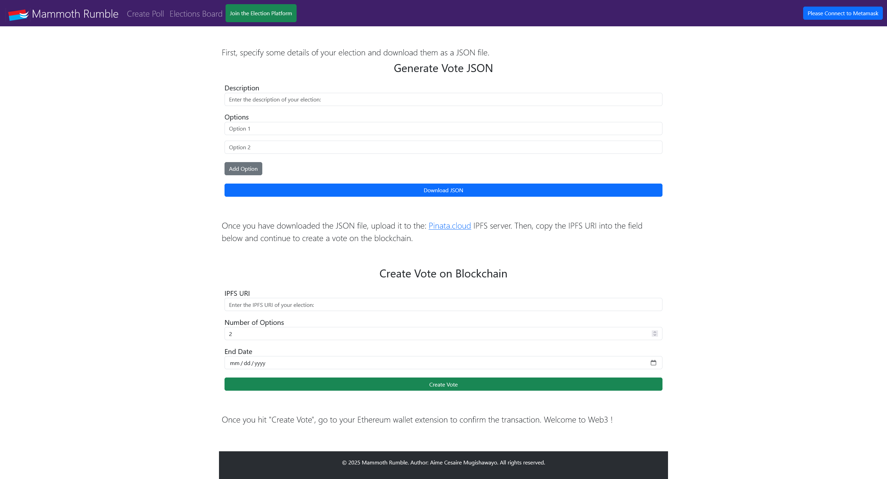

Here's an updated `README.md` that includes the screenshots:

---

# Decentralized Voting - Frontend

## Introduction

The frontend of the Decentralized Voting project serves as the user interface for creating, managing, and participating in elections. Built with modern web technologies, it connects to the Ethereum blockchain, enabling seamless interaction with smart contracts. 

This interface solves the problems of election opacity and manipulation, particularly in smaller institutions where elections are often conducted using insecure tools like Google Forms. By integrating blockchain technology, the system ensures transparency, trust, and immutability in the voting process.

## Technologies Used

### Frontend Framework:
- **React.js**: A JavaScript library for building dynamic and responsive user interfaces.
- **EJS**: For rendering dynamic HTML content in templates.

### Styling:
- **Bootstrap**: For responsive and modern UI components.
- **CSS**: For custom styles and layout adjustments.

### Ethereum Interaction:
- **Ethers.js**: For communicating with Ethereum smart contracts.
- **MetaMask**: A browser-based wallet to enable user authentication and blockchain transactions.

### APIs and Standards:
- **EIP-1193**: For standardizing communication between the frontend and Ethereum providers.
- **Pinata (IPFS)**: To fetch decentralized election metadata stored off-chain.

## Features

- **View Active Elections**: Fetch and display all elections from the blockchain.
- **Cast Votes**: Submit votes securely via the blockchain.
- **Live Results**: Display real-time election progress using progress bars and percentages.
- **Responsive Design**: Ensure accessibility across devices.

## Screenshots

### Homepage


### Create Poll


## Installation & Setup

### Prerequisites
Ensure you have the following installed:
- **Node.js** (v14 or higher)
- **NPM** or **Yarn**
- **MetaMask** browser extension

### Steps

1. Clone the repository:
    ```bash
    git clone https://github.com/AimeCesaireM/Decentralized-Voting.git
    ```

2. Navigate to the frontend folder:
    ```bash
    cd Decentralized-Voting/frontend
    ```

3. Install dependencies:
    ```bash
    npm install
    ```

4. Start the development server:
    ```bash
    npm run dev
    ```

5. Open the app in your browser:
    ```plaintext
    http://localhost:3000
    ```

### Connecting to the Blockchain

1. Ensure your MetaMask wallet is installed and configured for the appropriate Ethereum network.
2. Import the deployed contract's address and ABI into the `contract` instance in your application. Update the configuration in the frontend code as necessary.
3. If you downloaded the `backend` folder and followed those instructions then you do not need to update the frontend code (at least for purposes of connecting)


## Key Functionalities

### Viewing Elections
- **Fetch Data**: Retrieves elections from the blockchain using event filters.
- **Display Data**: Displays election descriptions, options, and progress using Bootstrap cards and progress bars.

### Voting
- **Secure Voting**: Allows users to cast votes through blockchain transactions.
- **Real-Time Updates**: Updates the UI dynamically with current vote counts and percentages.

### Error Handling
- Alerts users when blockchain interactions fail, ensuring clarity and usability.

## Deployment

1. Build the production files:
    ```bash
    npm run build
    ```

2. Serve the files using any static hosting service (e.g., Vercel, Netlify, AWS S3).

3. Ensure the environment variables point to the correct deployed contract and network.

## Future Enhancements

- **Authentication**: Improve user experience with wallet-based authentication.
- **Election Filtering**: Add filters for active, upcoming, and ended elections.
- **Dark Mode**: Introduce a dark mode for better accessibility.

## License

This project is licensed under the MIT License.